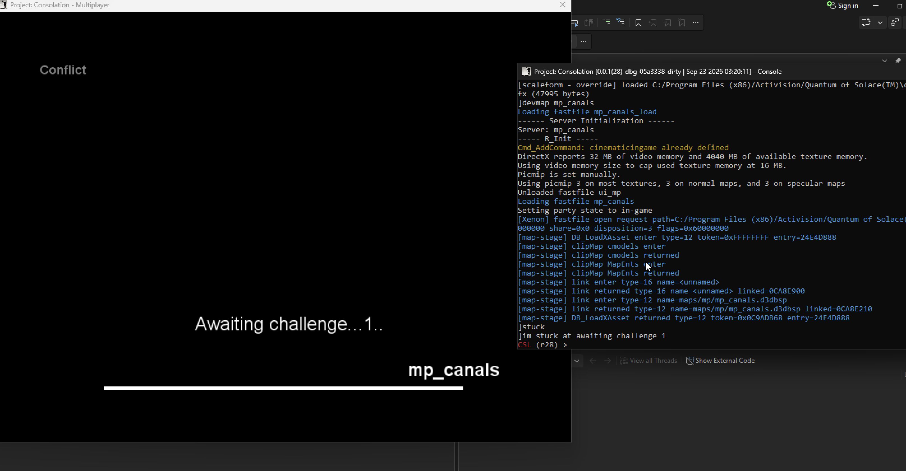
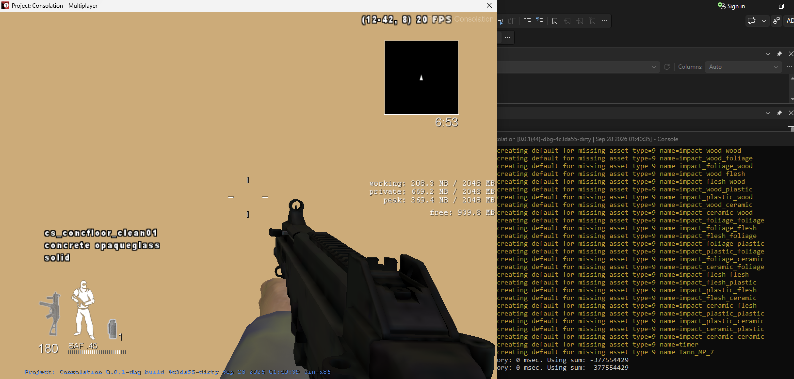
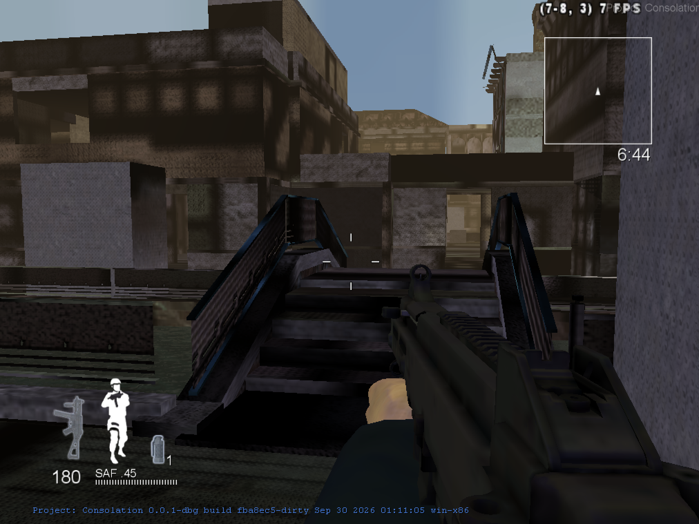
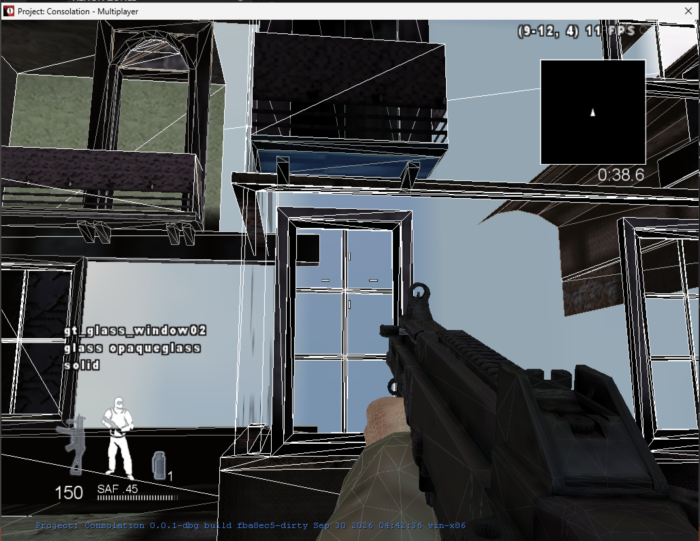
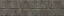
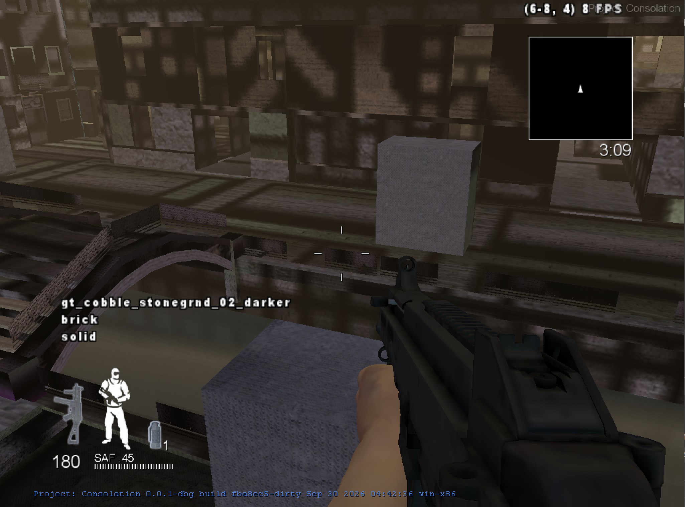
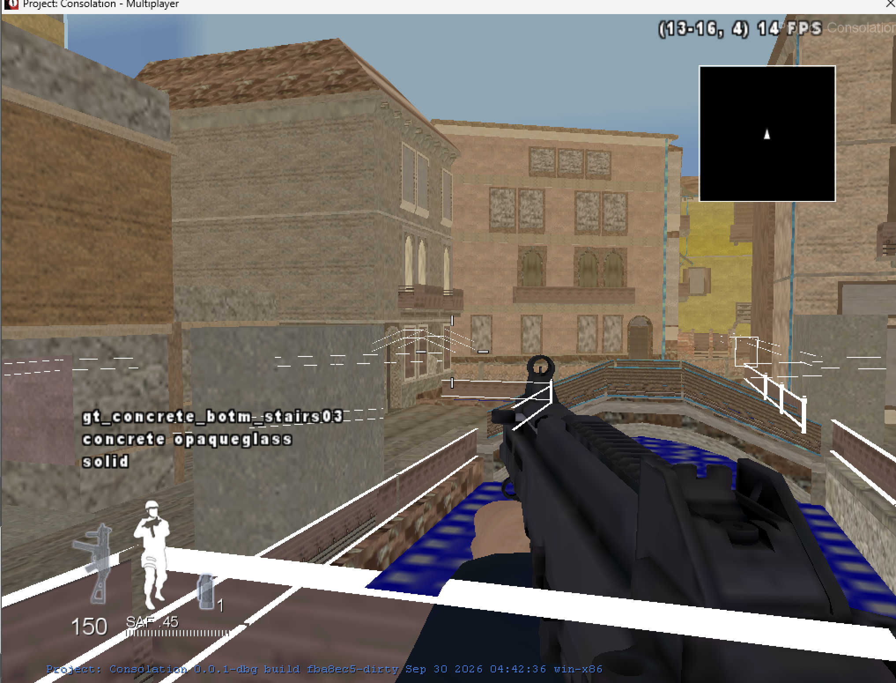

# Bringing DLC to PC: Fastfile Devlog

First, a bit of context: I'm running the game through an emulation layer in an
ARM Windows virtual machine on a MacBook. Performance is horrible, which makes
development a bit harder to do reliably, especially when I need to get into a
map to test something. Even a small change can mean another slow trip through
the loading screen just to find out it still looks wrong.

I've been working on getting the Xbox 360 DLCs running on PC in
Project: Consolation. I'm keeping this diary locally for now, with the idea of
putting it on the wiki later. Canals is the main test target, but I also have Barge as a test comparison on
both platforms, which gives me something to compare against when things go wrong.

Getting into the map was the first hurdle. Getting it to actually look and play
right is a much bigger job.

To work on the fastfiles, I made a zone tool in Python based on Mo's
(michaeloliverx's) fork of OpenAssetTools. It gives me a way to inspect, dump, and
work on converting the zone data without having to do everything inside the
game. It's still a work in progress, and some asset types aren't supported yet.

The gameplay screenshots are from my tests, with build dates visible in most
of them. I also generated the two small texture previews while checking the
decoder. I've kept the original images in `images/`.

## September 24, 2026: Getting Inside the Map

I finally got into Canals. Before this, I was either stuck at "Awaiting
challenge" or crashing somewhere in the asset loader. Reaching gameplay meant
the converted zone was at least getting through enough of the PC loader to start
the map.

*One of my earlier loading stalls. This is the game's own loading screen, not the
preload overlay.*

There wasn't much to see once I got in: mostly beige, with my weapon and HUD
floating in front of it. Later tests showed collision and lighting working, but
the map itself still wasn't rendering properly.

I also started working through the Xbox texture format. Swapping the fastfile's
byte order isn't enough. Xenos stores textures in tiles and has its own GPU byte
swapping, so I needed to handle those separately to get usable PC image data.

## September 27, 2026: Following Asset Dependencies

I spent this stage following techsets and image references. Some materials
refer back to assets loaded earlier in the zone. Those links need rebuilding
when I write the PC zone; keeping the original Xbox pointer won't work once the
data has moved.

The technique-state slots differ too. Similar names helped me find possible PC
counterparts, but I couldn't assume the shaders were interchangeable. I started
using native PC materials and their state tables as references, and kept track
of the fallback mappings so I could revisit them.

I prepared `common_xenon.ff` to preload shared PC rendering assets. I added a
loading overlay around that later, although the overlay appearing doesn't tell
me whether every asset dependency has actually resolved.

## Between Milestones: The White-World Problem

Well, you might look at this and wonder why I'm calling it white when it's
clearly beige. The map GSC and vision files have loaded, so the white material
gets that beige appearance from the map's vision settings.

*I could read a material name while looking at a mostly empty world.*

At first this made me think the materials were fine and only the images were
missing. But the trace can give me a collision material without telling me what
the renderer is actually drawing. I still needed to check the draw material and
its texture bindings in the PC renderer.

Barge helped here because I could compare the same map on both platforms instead
of guessing from Canals alone. I used the Wii symbols for names where useful,
but checked the actual layouts against the PC game.

## September 30, 2026: Geometry Finally Appears

*I can finally see the bridge and buildings. There are still missing faces and
plenty of dark or wrong-looking textures.*

Seeing actual geometry was a huge milestone after so many blank-world tests.
It also gave me something concrete to inspect. The map was far from finished,
though, and the next few tests still had holes and strange materials.

I wrote a Python script to compare all 5,019 surfaces. Their local triangle
indices and vertex ranges were valid, and the referenced vertices fit inside
their surface bounds.
I also compared winding against native PC Barge. Both platforms agreed, so I
left the index order alone rather than reversing everything as another guess.

I found materials with incomplete texture sets still using their original
techniques. I made those fallbacks explicit and resolved the PC identity normal
map where it was needed. That reduced the number of incomplete materials, but
didn't restore all the missing surfaces.

### Glass Is Still an Open Question

*This window reports `gt_glass_window02`. The pale blue areas aren't limited to
glass, though.*

I wondered if the glass issues could be caused by the fact that glass can be a
destructible in the CoD engine. I remember some issues with missing glass in the
early zonetool days.

### A Verified Packed-Mip Bug, but No Visible Breakthrough

I found a definite decoding bug in `gt_concrete_white_trim_c`, a 512x128 DXT1
texture. Its smaller mip levels share a packed tile on Xbox. My decoder was
reading them as separate allocations, so it picked up the wrong part of the tile.

Old level 3:

Corrected level 3:

*These previews are only 64x16. The corrected one actually contains the stone
texture, rather than the dark fragments I was getting before.*

I adapted the packed-tail offsets from
[Xenia's texture utilities](https://github.com/xenia-project/xenia/blob/master/src/xenia/gpu/texture_util.cc).
I've credited that in the decoder. I added checks for the fetch dimensions and
format, plus tests for shared tiles and GPU byte swapping. My game is using mip
level 3, so this seemed like a promising explanation for some of the bad textures.

I installed the corrected zone and checked its hash. Then I loaded Canals again,
and it looked pretty much the same:

*My latest test without wireframe. The repeating dark patches and geometry gaps
are still there.*

The decoder fix is real, but it clearly isn't the whole problem. I still need to
find out whether the live material is using that image correctly and what its
other inputs look like. I'm keeping the fix and following the remaining texture,
lighting, and draw paths.

### What the Vertex Comparison Established

I checked the PC vertex declaration against the converter's 44-byte layout.
Then I compared a wider Barge sample: 141,979 source vertices had matching
positions in the PC array, with 74,791 exact full records and 89,392 matching
diffuse UVs. Those are record counts, not unique positions or Canals coverage.

That gives me a good reason not to blindly swap the UV fields. It doesn't mean
every surface is correct: the two platform cooks can split vertices differently,
and matching a position isn't enough to identify the same surface or material.

## Current Status and Next Evidence

### October 1, 2026: Trying Fullbright

The game was lagging so much that I tried `r_fullbright 1`, hoping it would help
performance. That turned out to be a useful test for a different reason: the
textures suddenly looked much closer to what I expected.

*The buildings look much more recognizable with fullbright on. Some surfaces
are still wrong, including the white fence and blue areas.*

I'd been chasing what looked like bad textures, but this makes the lighting path
a much stronger suspect. It doesn't prove every texture is correct, or tell me
whether the problem is in the lightmaps, normal maps, or lit techset bindings.
It does give me a better direction than blindly changing the diffuse UVs again.
Fullbright is just a test here; I still want the map working with normal lighting.

I then tried `r_fullbright 0` with `r_normalMap 0`, which replaces the normal
maps with flat normals. The dark repeating patches disappeared. That narrowed
things down much more than fullbright alone.

I disassembled native PC shaders and found that their alpha and green channels
encode normal slopes. My DXN conversion was copying the channels straight
across. I've added a separate probe that reconstructs the normal and re-encodes
it for that PC shader decode. The tests pass for flat and tilted normals, but I
still need to see how it behaves on the actual map before making it the default.

The first test looked better, but patches remained farther away. Flattening the
normals removed those too. Following one cobblestone material turned up a much
more obvious mistake: my generic slot matching had given it wood-door textures.
The hashes identify normal/color/specular slots, not which texture belongs there.
I'm testing a narrow cobblestone-family correction while I work toward resolving
the actual packed stream addresses. This isn't a general solution yet.

That cobblestone test worked. I've expanded the same approach to other material
families, using complete name roots and matching sampler slots. If a shared
reference produces conflicting image names, I leave it alone rather than pick
one at random. Every new family match is listed in the conversion report as
provisional. This should tackle more of the wrong concrete, brick, wood and
glass textures, but it still needs an in-game check and doesn't solve missing
geometry by itself.

The windows still looked wrong after that. I checked the running game and found
their actual color image bound with a GPU texture, so this wasn't another missing
image. The native PC alpha-test techset has seven state records, while my generic
conversion of the Xbox glass produced six with a different slot table. I'm now
testing the native PC state template for this techset family. It may also help
cutout surfaces that look like missing geometry, but I haven't confirmed that yet.

I'm also checking what is still missing before calling this a full map. A big
gap is the layered `*...` materials: the converter currently chooses a simpler
PC techset, losing their actual blending. The source also has map-local sounds
and effects that aren't emitted yet. I've added a completeness audit to the
conversion report so these omissions remain visible alongside the material
fallbacks. Getting into the map is not the same as finishing the conversion.

I can get into Canals, walk on its collision, and see some of the world. Textures
and water are rendering now. There are still missing pieces, repeating dark
patterns, and problems around glass and lighting. It's progress, but it isn't
ready yet.

I validated 302 material techset links and 1,520 image references in the
latest zone. The four focused mip tests pass, and the full converter suite passes
97 of 98 tests. The remaining geometry-layout test still has an older static-model
expectation that needs updating. For this candidate I generated the zone without
building the C++ project or making a commit.

My next step is to pick one visibly wrong surface and follow its actual render
material, texture slots, sampler state, and UVs. Where I can, I'll compare it with
a matching PC surface. I'm also keeping the missing-geometry investigation
separate, since fixing a texture won't necessarily fix a surface that never gets
drawn.

I'm keeping the detailed layouts, checks, and zone hashes in
[my research notebook](../../zone-research.md). I'll add to this diary as I test
new versions, including the attempts that don't make things look any better.

### October 1: Following The Layered Materials

I wrote a Python probe to walk the inline world materials in stock PC Barge.
It recovered 103 material records, which let me compare actual render materials
instead of trying to infer them from the collision names.

Eight Xbox composite surfaces have bounds matching PC surfaces with ordinary
materials. One rust layer matches `wc/bg_rustdecal_04`, using
`,wc_l_sm_b0c0`; another matches `wc/cs_grass_01`, using
`wc_l_sm_b0c0n0s0`. This makes me suspect that some Xbox layered surfaces were
split into separate base and decal surfaces for PC. Matching bounds alone isn't
enough to prove that, so I still need to compare their triangles and UVs before
copying that approach into the converter. Simply choosing another single-layer
techset would still throw away part of the material.

The probe now completes, and I added a passing regression test for the material
record's serialized end offset. This is investigation progress, not a new visual
fix; I haven't replaced the installed zone with another guess.

The next comparison gave me something more concrete. Three Barge surfaces have
the same triangle positions on both platforms, but PC uses the Xbox secondary
layer's UVs as its normal texture coordinates. Those UVs match byte for byte.
The sign uses eight bytes per layer vertex; two other decals use twelve. So
swapping the techset alone can't fix these materials: the texture coordinates
have to follow the layer too. I haven't applied that blindly to Canals, since I
still need to preserve the base layer and work out the blending.
### October 2: Looking Beyond Barge

I added a conversion step that clones the vertices used by an overlay and moves
its secondary UVs into the PC texture-coordinate field. It leaves the base
vertices alone, so fixing one layer won't change another surface sharing them.
The tests cover both verified record sizes, index remapping, and truncated data.
This isn't switched on in the zone yet: the overlay still needs its own material
and the right blend state.

I also checked the other installed PC maps. Docks gave me 39 validated overlay
material candidates, including concrete cracks, trash, and the oil-stain material
I compared in Barge. Several other zones couldn't be parsed consistently by my
current donor reader. I'm not treating those as verified donors until I fix that.
There hasn't been another in-game improvement from this work yet.
I now have a test zone using both Docks and Barge as donors. Seven Canals
materials match native PC names and sampler definitions, including two window
materials and the cracked-concrete decal. `gt_glass_window03` uses a different
techset on PC, so I used that native material instead of trying another guessed
fallback. I kept the previous zone as a backup before installing this candidate.

The offline check validated 1,520 image links and 302 material-techset links with
no invalid links. The converter tests pass 109 of 110 tests; the existing static-
model layout expectation still fails. The layered overlays are not enabled yet,
and I still need an in-game comparison before calling these material changes an
improvement.
### October 2: Giving the Props Their Materials

I found another fairly basic gap: the converter was writing the models' geometry,
but binding every model surface to `white`. That meant getting the buildings to
show up wasn't enough to make the props around them look right.

I changed the model writer to use converted material handles where I have an
exact PC techset and the required images. I also moved those dependencies ahead
of the models in the zone, since the PC loader needs them to exist when it
resolves the handles. I didn't use world techsets as guesses for model shaders.

This candidate keeps 74 models, 207 supported rigid model surfaces, and all
1,206 captured placements. It replaces the white fallback in 49 of the 234
model-material slots. The other 185 still use the explicit fallback: many are
shared references I haven't resolved, while others need unsupported techsets or
geometry. Those omissions now appear in the conversion report instead of being
hidden behind a successful zone load.

I checked every serialized model record and placement handle, plus 1,662 image
links and 351 material-techset links. None of those checks found an invalid link.
The regression suite still has the same one static-model layout failure out of
110 tests, so I am not calling the whole converter verified. I backed up the
previous zone and installed this candidate; the visual result still needs a
fresh map load.

I also checked `cs_concfloor_clean01` against native PC zones. Its texture names
and five material constants match, including the detail scale. That rules out
one simple explanation for the floor artifacts, but not a bad normal-image
conversion. The dark floor patterns, glass, and missing layered overlays remain
separate unfinished work. This isn't a complete Canals conversion yet.

### October 2: The Sky Was Only One Face

My next test showed a badly stretched sky. The material diagnostic identified
`sky_bog`, which turned out to be a useful clue: its image is a cubemap, but my
image writer had been treating it as an ordinary 2D texture and keeping only
the first face.

I found the same `sp_bog_ft` image in PC Eco Hotel and Italia. After untiling all
six Xbox faces, the full 196,608 bytes match the PC image exactly, including the
face order. That is a much better basis for a fix than trying another sky techset.

The converter now keeps all six faces and writes the native PC cubemap type,
load flags, and no-picmip field. I added tests for capturing the faces, writing
the PC image, and rejecting truncated faces or unverified cubemap mip layouts.
The suite passes 112 of 113 tests, with the same existing world-layout failure.
This still needs an in-game check before I can call the sky fixed.

The emitted cubemap header, load definition, and all six faces now match native
PC byte-for-byte. The model and material link audits still pass. I installed
this combined candidate with another backup; the file hashes match, but the
running map needs to be reloaded to use it.
